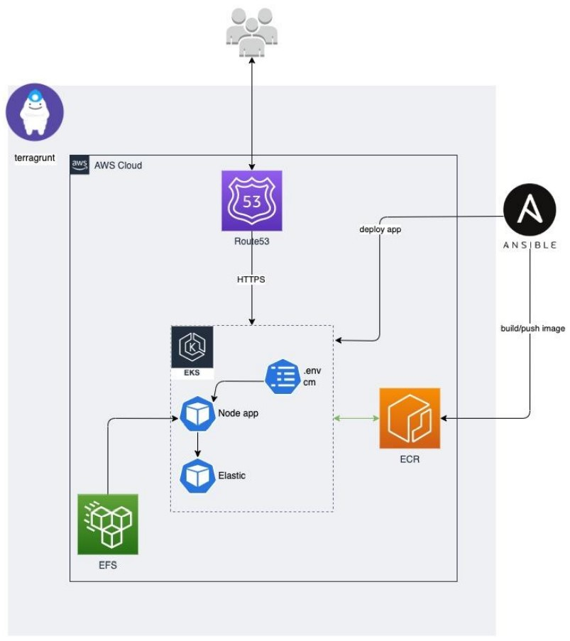

# Project scheme


# Requiremetns
* Before start you should install :
  - *[AWS CLI](https://docs.aws.amazon.com/cli/latest/userguide/getting-started-install.html)*
  - *[Terraform](https://developer.hashicorp.com/terraform/downloads)*
  - *[kubectl](https://kubernetes.io/docs/tasks/tools/)*
  - *[Helm](https://helm.sh/docs/intro/install/)*


# Create infrastructure
* Perform the following steps :
```
  cd infrastructure/
```
```
  terragrunt run-all plan
```
```
  terragrunt run-all apply
```
  *I can't but mention that infrastructure creation takes at least 70 minutes.*
  
# Update kubeconfig
* After infrastructure provisioning run :
```
aws eks update-kubeconfig --region us-east-1 --name education-eks
```

# Prepare your EKS cluster
* Install the following :
  - *[AWS Load Balancer Controller](https://docs.aws.amazon.com/eks/latest/userguide/aws-load-balancer-controller.html#lbc-install-controller)*
  - *[Amazon EFS CSI driver](https://docs.aws.amazon.com/eks/latest/userguide/efs-csi.html)*
  - *[Secrets Store CSI Secret driver and AWS Secrets and Configuration Provider (ASCP)](https://www.eksworkshop.com/beginner/194_secrets_manager/configure-csi-driver/)*
  
# Prepare needed IAM Roles
  1) Create IAM Policy with access to your Secrets Manager secret (replace `YOUR_SECRET_ARN` with your Secrets Manager secret ARN) :
```
{
    "Version": "2012-10-17",
    "Statement": [
        {
            "Effect": "Allow",
            "Action": [
                "secretsmanager:GetSecretValue",
                "secretsmanager:DescribeSecret"
            ],
            "Resource": "YOUR_SECRET_ARN"
        }
    ]
}
```

  2) Create Role for access with our ServiceAccount to the Secrets Manager:
      * for `Identity provider` choose one available `OpenID Connect` which was automatically created during infrastructure provisioning;
      * for `Audience` choose `sts.amazonaws.com`;
      * for `Permission policies` choose our policy from the first step;
      * create your role. After this edit its `Trust Relatoinship` like below (replace `YOUR_AWS_ACCOUNT_ID` and `YOUR_EKS_CLUSTER_ID` with approptiative values) :
```
{
    "Version": "2012-10-17",
    "Statement": [
        {
            "Effect": "Allow",
            "Principal": {
                "Federated": "arn:aws:iam::YOUR_AWS_ACCOUNT_ID:oidc-provider/oidc.eks.us-east-1.amazonaws.com/id/YOUR_EKS_CLUSTER_ID"
            },
            "Action": "sts:AssumeRoleWithWebIdentity",
            "Condition": {
                "StringEquals": {
                    "oidc.eks.us-east-1.amazonaws.com/id/YOUR_EKS_CLUSTER_ID:sub": "system:serviceaccount:application:app"
                }
            }
        }
    ]
}
```

  
  
  
  
  
  
  
  
  
  
  
  
